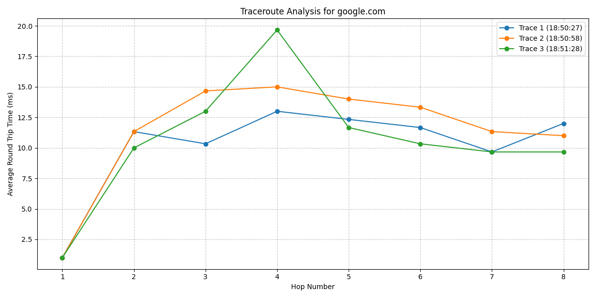

# The Amazing Trace

Ever want to condense the information given by a tracert? Well I hope you do now because that's exactly what this script does. It let's you run a tracert (or traceroute depending on the platform) on any IP or Hostname and then it will spit out all of the information into a condensed format! But it will most likely do the feature detailed here:

There's a feature that will take all of the information gathered and make it into a line graph for better data analyzation and visualization (refer below). A typical run of the script will look like this:

## Set Up and Installation

There's quite a few dependencies for this script, so I recommend just using the Vagrant file included in the repository for the easist set up. Alternatively, you can use the two commands here to install everything that is needed: 

1. `pip install matplotlib pandas numpy`
2. `pip install tracert`

Yes, for some reason you do need to install tracert.

To get the actual script, the file you need to clone is `amazing_trace.py`. Use whatever method you want to close the file.

## Features
There are a few features to take note of, mostly the graph generation!

- __Graphical Generation.__ This feature was included in the assignemnt by my teacher. It will basically just take any tracert and then turn it into a line graph. You can turn it off my commenting out the very bottom section of code or change the destinations to whatever you want. An example of what a graph may look like is included here:

  

- __Version Compatibility.__ Whether you use Windows or Linux, the code will run either way! So no worries about the code exploding if you use either one.